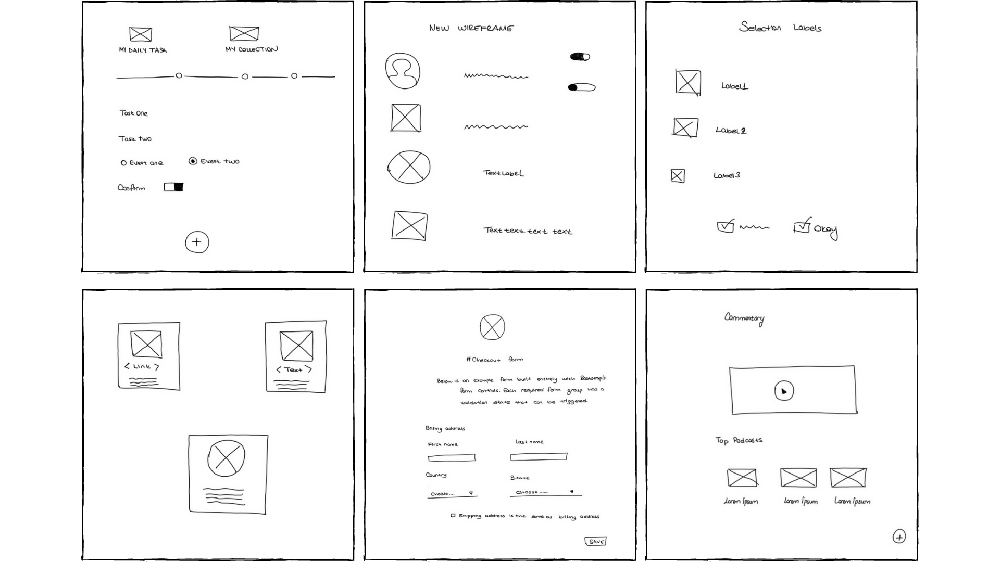

# Example Wireframes with UI Elements

# Citation
KAZANGIRLER, C.B., OZCAN, C.,  [Elle Çizilmiş Taslak Çizimlerde Kullanıcı Arabirimi Öğelerinin Derin Örnek Segmentasyonu](https://www.researchgate.net/publication/354280814_Elle_Cizilmis_Taslak_Cizimlerde_Kullanici_Arabirimi_Ogelerinin_Derin_Ornek_Segmentasyonu), In: International Conference on Data Science and Applications (ICONDATA), 2021.

# Classes of Dataset

| Classes |  Detection and Segmentation |
|:--------:|:------------------:|
|     Button   | :heavy_check_mark: |
|     Image    | :heavy_check_mark: |
|     Input    | :heavy_check_mark: |
|     Textarea | :heavy_check_mark: |
|  Text Header | :heavy_check_mark: |
|     List     | :heavy_check_mark: |
| Text Paragraph | :heavy_check_mark: |
|    Table   | :heavy_check_mark: |
|    Dropdown   | :heavy_check_mark: |
|    Checkbox  | :heavy_check_mark: |
|    Radio Button   | :heavy_check_mark: |
|    Box    | :heavy_check_mark: |
|    Toggle   | :heavy_check_mark: |
|    Video   | :heavy_check_mark: |
|    Rating   | :heavy_check_mark: |
|    Chip  | :heavy_check_mark: |
|    Slider   | :heavy_check_mark: |
|    Text Label  | :heavy_check_mark: |
|    Link   | :heavy_check_mark: |
|    Date Picker   | :heavy_check_mark: |
|    Stepper Input | :heavy_check_mark: |
|    Line Break   | :heavy_check_mark: |
|    Phone Icon   | :heavy_check_mark: |
|    Mail Icon    | :heavy_check_mark: |
|    Bell Icon   | :heavy_check_mark: |

# Request Dataset

Please send an e-mail to cahitberkaykazangirler@gmail.com to receive a link to the UIBEE dataset. Your e-mail must be sent from a legitimate institutional account and include the following text (copy and paste the following text into the required fields):

"Subject: **Request to download UIBEE dataset**.

Name: [your first and last name]

Affiliation: [university where you work]

Department: [your department]

E-mail: [must be the e-mail at the above mentioned institution]

I have read and agreed to follow the terms and conditions below: The use of the UIBEE dataset is defined by the following conditions:

This dataset is provided “AS IS”, without any express or implied warranty. Although every effort has been made to ensure accuracy, UIBee does not take any responsibility for errors or omissions;

Without the expressed permission of UIBee, any of the following will be considered illegal: redistribution, modification, and commercial usage of this dataset in any way or form, either partially or in its entirety;

All images in this dataset are only allowed for demonstration in academic publications and presentations;

This dataset will only be used for research purposes. I will not make any part of this dataset available to a third party. I’ll not sell any part of this dataset or make any profit from its use.

[your signature]"  

P.S. A link to the dataset file will be sent as soon as possible.
